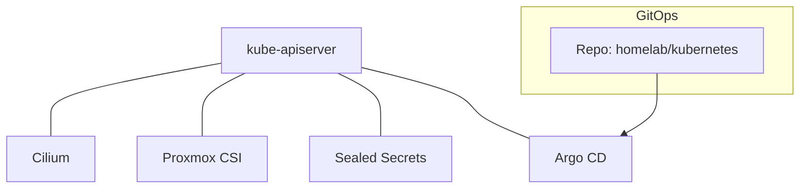

# Homelab Architecture

Architecture overview of the Homelab setup using Proxmox, Talos, and Kubernetes.

## Infrastructure (Proxmox + Talos)
```mermaid
flowchart LR
  subgraph Proxmox Cluster (draco)
    PVE1[Proxmox Node]
  end

  subgraph Talos VMs
    CP1[Control Plane VM]
    W1[Worker VM]
    W2[Worker VM]
  end

  PVE1 --- CP1
  PVE1 --- W1
  PVE1 --- W2

  subgraph Kubernetes Layer
    K8s[(Kubernetes Cluster)]
  end

  CP1 --> K8s
  W1  --> K8s
  W2  --> K8s
```

Notes
- Proxmox cluster `draco` hosts Talos VMs (1 control plane, 2 workers).
- The Talos VMs together form the Kubernetes cluster.
- Infra defined in `tofu/` and `tofu/talos/`.

## Kubernetes (Software Components)


References
- Cilium: `kubernetes/bootstrap/cilium/values.yaml`
- Proxmox CSI: `kubernetes/infra/proxmox-csi/*` and `templates/secrets/proxmox-csi.yaml.tmpl`
- Sealed Secrets: `kubernetes/infra/sealed-secrets/*`
- Argo CD: `kubernetes/infra/argocd/*`