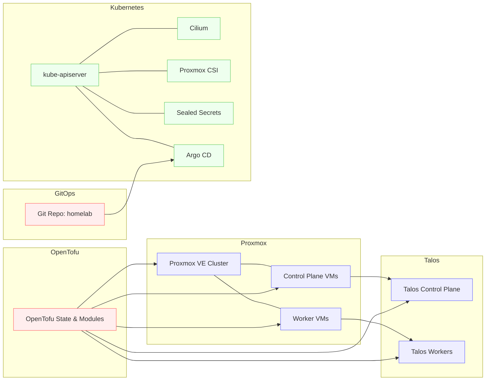

# Homelab Architecture

A high-level view of the current setup. This will evolve as we iterate.

## Notes
- Proxmox hosts run Talos VMs for control plane and workers.
- OpenTofu provisions Proxmox resources and outputs Talos/Kube configs.
- Kubernetes is bootstrapped with Cilium, Sealed Secrets, and Argo CD.
- Argo CD syncs from this repository for infra/apps.