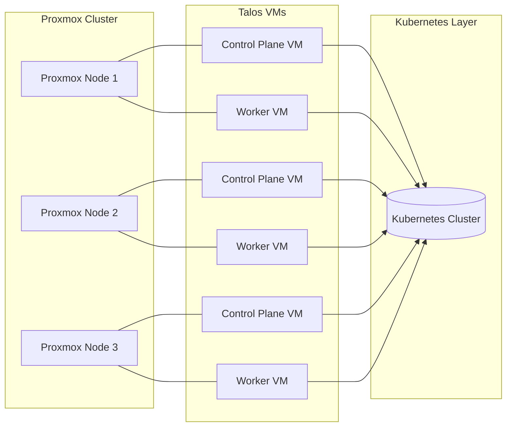

# Homelab Architecture

Architecture overview of the Homelab setup using Proxmox, Talos, and Kubernetes.

## Infrastructure (Proxmox + Talos)

Notes
- Proxmox nodes host Talos VMs (control plane and workers).
- The Talos VMs together form the Kubernetes cluster.
- Infra defined in `tofu/` and `tofu/talos/`.

## Kubernetes (Software Components)

References
- Cilium: `kubernetes/bootstrap/cilium/values.yaml`
- Proxmox CSI: `kubernetes/infra/proxmox-csi/*` and `templates/secrets/proxmox-csi.yaml.tmpl`
- Sealed Secrets: `kubernetes/infra/sealed-secrets/*`
- Argo CD: `kubernetes/infra/argocd/*`